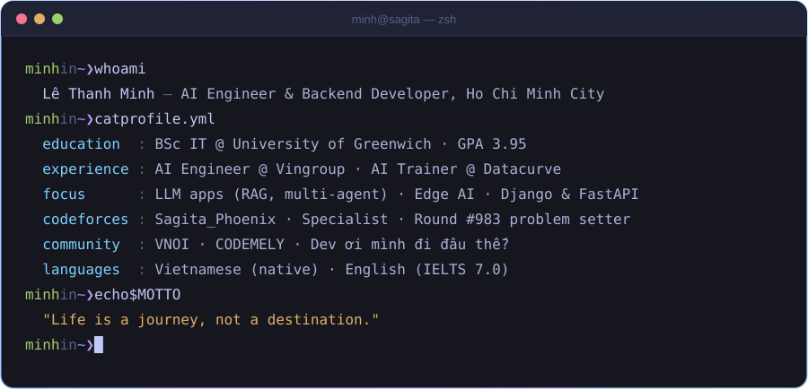

<!-- ============================== HEADER ============================== -->

  

  

  
  
  
  
   
  
  

<!-- ============================== ABOUT ============================== -->
## 👨‍💻 About Me

I'm a software developer from Vietnam who likes hard problems — algorithms first, then turning them into real products. My work sits where **backend engineering**, **AI/LLM applications** and **edge computing** meet.

  

## 💼 Experience

<table>
  <tr>
    <td width="72%">
      <b>AI Engineer</b> · <a href="https://vingroup.net">Vingroup</a> — <i>AI in Action Program</i> 
      Ha Noi, Vietnam
    </td>
    <td align="right">May 2026 – Aug 2026</td>
  </tr>
  <tr>
    <td colspan="2">
      • Selected for Vingroup's competitive, intensive program on business-aligned AI products and AI infrastructure. 
      • Built an <b>AI educational assistant</b> (Llama 3 + LangChain) that suggests real-time teaching actions from student engagement, highlighted slide text and sentiment. 
      • Engineered an <b>e-commerce platform</b> on Multi-Agent RAG + ReAct (OpenAI API): a dual-chatbot system for customer support and store management.
    </td>
  </tr>
  <tr>
    <td width="72%">
      <b>AI Coding Assistant · AI Trainer</b> · <a href="https://datacurve.ai">Datacurve</a> 
      Vancouver, Canada — Remote
    </td>
    <td align="right">Dec 2023 – May 2025</td>
  </tr>
  <tr>
    <td colspan="2">
      • Solved real-world software engineering tasks and documented solutions for LLM training. 
      • Reviewed codebases and authored validated datasets for an IDE coding assistant; evaluated and improved LLM outputs. 
      • Java · Python · Django · MySQL · Prompt Engineering · Data Validation
    </td>
  </tr>
</table>

<!-- ============================== TECH ============================== -->
## 🧰 Tech Stack

<table align="center">
  <tr>
    <td align="right"><b>Languages</b></td>
    <td></td>
  </tr>
  <tr>
    <td align="right"><b>Backend & Mobile</b></td>
    <td></td>
  </tr>
  <tr>
    <td align="right"><b>AI & Data</b></td>
    <td>
       
      
      
      
      
      
      
      
      
      
    </td>
  </tr>
  <tr>
    <td align="right"><b>Data & Cloud</b></td>
    <td></td>
  </tr>
  <tr>
    <td align="right"><b>Tools & Edge</b></td>
    <td>
       
      
    </td>
  </tr>
</table>

<!-- ============================== PROJECTS ============================== -->
## 🚀 Featured Projects

<table>
  <tr>
    <td width="50%" valign="top">
      <h3>🥾 <a href="https://github.com/SagitaKDX/M-Hike">M-Hike</a></h3>
      Offline-first Android hiking app with a custom Firebase selective-sync algorithm, an AI semantic-search microservice (Gemini embeddings + cosine similarity) and typo-tolerant fuzzy search.  
      
      
      
      
    </td>
    <td width="50%" valign="top">
      <h3>🛒 <a href="https://github.com/SagitaKDX/E-comerce_Project">Real-Time E-Commerce</a></h3>
      Full e-commerce platform with a custom admin dashboard, loyalty tiers, social login, REST APIs and WebSocket live chat (Django Channels + Daphne).  
      
      
      
      
    </td>
  </tr>
  <tr>
    <td width="50%" valign="top">
      <h3>📷 Edge-AI Attendance System</h3>
      Automated lab attendance on an NVIDIA Jetson Nano: MOG2 motion detection, human tracking and face recognition, with secure on-device logging.  
      
      
      
    </td>
    <td width="50%" valign="top">
      <h3>🎙️ Offline AI Voice Assistant</h3>
      Private voice assistant for Mini PCs and Jetson devices — Whisper STT, Piper TTS and a locally hosted Llama model, no cloud required.  
      
      
      
    </td>
  </tr>
</table>

<!-- ============================== CP & COMMUNITY ============================== -->
## 🏆 Competitive Programming & Community

<table>
  <tr>
    <td width="50%" valign="top">
      
    </td>
    <td width="50%" valign="top">
      <b>🧩 Codeforces</b> — <code>Sagita_Phoenix</code>, Specialist (max 1532) 
      Problem setter & tester for <b>Codeforces Round #983 (Div. 2)</b>, played by ~20,000 contestants.  
      <b>🇻🇳 VNOI</b> — Volunteer (2020 – 2023) 
      Prepared and ran algorithm contests for university and gifted high-school students.  
      <b>🧠 CODEMELY</b> — Algo Leader (2023 – now) 
      CS community of 80,000+; organized the Rust Bootcamp (VBI, GFI, NEAR APAC) and a CTF competition.  
      <b>✍️ Dev ơi mình đi đâu thế?</b> — Content writer (2023 – now) 
      CS forum with 100,000 Facebook and 20,000 Discord members.
    </td>
  </tr>
</table>

## 🎖️ Awards, Research & Certificates

| Year | Achievement |
| :--: | :---------- |
| 2024 | 🥇 **FPT Edu Hackathon** — Top 14 National |
| 2024 | 🎓 **Top 3 Student** of the Spring semester, University of Greenwich |
| 2024 | 🔬 **Res Fes** — FPT Research Festival participant |
| 2024 | 📜 **Google AI Essentials** · **IELTS 7.0** |
| 2023 | 🏅 **Greenwich Coding Challenge** — First Prize (Junior), Second Prize (Senior) |
| 2023 | 📜 **Problem Solving (Intermediate)** · **VNOI Certificate** |
| 2023 – | 🧭 **Undergraduate Researcher** — *A novel A\* approach for shortest paths to rescue-supply locations during natural and military disasters* |

<!-- ============================== GITHUB STATS ============================== -->
## 📊 GitHub Activity

  

  
  

  

  

<!-- ============================== FOOTER ============================== -->

  

